# story-automator — Designed Workflow Reference

Canonical diagram of how the `story-automator` skill is **supposed**
to execute. Read alongside `workflow.md` (the orchestrator entry) and
the `steps-c/` / `steps-v/` / `steps-e/` step files (the per-step
instruction bodies).

This file is a reference — the step files are authoritative. If a step
file says one thing and this diagram shows another, the step file
wins; this diagram is wrong and should be fixed.

## Purpose

This diagram exists so the orchestrator agent (and any future
enforcement code) has an unambiguous picture of:

1. The complete set of steps that must run for a sleep-mode build
   cycle to be considered `COMPLETE`.
2. The mandatory state-document writes at each step boundary
   (`currentStep`, `stepsCompleted`, `status`).
3. Which transitions are auto-proceed (no human input) vs. menu-halt
   (wait for `[R]/[V]/[M]/[S]/[X]`).
4. The ScheduleWakeup self-pump cadence that keeps overnight runs
   alive.

If any step required by this diagram has no entry in the state
document's `stepsCompleted` array when `step-04-wrapup` runs, the
run did not actually complete — even if `status` was set to
`COMPLETE` somewhere upstream.

## Full designed flow (create mode + resume mode)

```mermaid
flowchart TD
  classDef entry fill:#cce5ff,stroke:#0066cc,color:#004085
  classDef preflight fill:#e2d9f3,stroke:#6f42c1,color:#3d2c5c
  classDef loop fill:#d1ecf1,stroke:#17a2b8,color:#0c5460
  classDef terminal fill:#d4edda,stroke:#28a745,color:#155724
  classDef state fill:#fff3cd,stroke:#ffc107,color:#856404,stroke-dasharray:4 4
  classDef external fill:#e9ecef,stroke:#6c757d,color:#383d41

  WF[workflow.md<br/>Configuration + Mode Determination]:::entry

  WF -->|mode=create| S01
  WF -->|mode=resume + path| S01B
  WF -->|mode=resume + no path| LATEST{state-latest-<br/>incomplete<br/>found?}
  WF -->|mode=validate| SV[steps-v/<br/>step-v-01-check]:::entry
  WF -->|mode=edit| SE[steps-e/<br/>step-e-01-load]:::entry

  LATEST -->|yes| S01B
  LATEST -->|no| S01

  S01[step-01-init<br/>1. Verify Stop hook<br/>2. Load rules<br/>3. Check existing state<br/>4. Welcome<br/>5. Check sprint-status<br/>6. Setup init log]:::preflight

  S01B[step-01b-continue<br/>1. Load state document<br/>2. Verify vs sprint-status<br/>3. Check active sessions<br/>4. Present status<br/>5. Present menu R/V/M/S/X<br/>6. Handle choice]:::preflight

  S01B -->|R - resume| ROUTE{route by<br/>currentStep<br/>+ status}
  S01B -->|V - view log| S01B
  S01B -->|M - modify| S01B
  S01B -->|S - start over| S02
  S01B -->|X - abort| ABORT[status=ABORTED<br/>terminate]:::terminal

  ROUTE -->|status=READY| S02B
  ROUTE -->|status=INITIALIZING| S02A
  ROUTE -->|status=IN_PROGRESS<br/>step-03-execute| S03
  ROUTE -->|status=IN_PROGRESS<br/>step-03a-execute-review| S03A
  ROUTE -->|status=IN_PROGRESS<br/>step-03b-execute-finish| S03B
  ROUTE -->|status=IN_PROGRESS<br/>step-03c-execute-complete| S03C
  ROUTE -->|status=EXECUTION_COMPLETE<br/>or COMPLETE| S04

  S01 -->|auto-proceed| S02

  S02[step-02-preflight<br/>parse epics<br/>compute complexity<br/>display matrix]:::preflight
  S02 -->|auto-proceed| S02A
  S02A[step-02a-preflight-config<br/>agent configuration<br/>policy snapshot<br/>status=INITIALIZING]:::preflight
  S02A -->|auto-proceed| S02B
  S02B[step-02b-preflight-finalize<br/>create state document<br/>create marker file<br/>status=READY]:::preflight

  S02B -->|auto-proceed| S03

  subgraph STORY_LOOP[FOR EACH story in storyRange]
    direction TB

    S03[step-03-execute<br/>currentStep:=step-03-execute<br/><br/>A. create-story<br/>B. dev-story<br/><br/>append step-03-execute<br/>to stepsCompleted]:::loop

    S03 -->|auto-proceed| S03A

    S03A[step-03a-execute-review<br/>currentStep:=step-03a-execute-review<br/><br/>C. automate guardrails<br/>D. code review loop<br/><br/>append step-03a-execute-review<br/>to stepsCompleted]:::loop

    S03A -->|auto-proceed| S03B

    S03B[step-03b-execute-finish<br/>currentStep:=step-03b-execute-finish<br/><br/>E. git commit<br/>E.5 push + open PR<br/>E.6 Copilot review loop<br/>    - sr-dev 4-question gate<br/>    - resolveReviewThread for false pos<br/>    - re-trigger Copilot<br/>    - until 3-signal convergence<br/>    - or hit safetyCap=15<br/>auto-merge --squash --delete-branch --auto<br/>F. verify sprint-status<br/>G. story complete<br/>H. epic completion check<br/>   trigger retrospective YOLO<br/><br/>append step-03b-execute-finish<br/>to stepsCompleted]:::loop
  end

  S03B -->|loop: next story| S03
  S03B -->|all stories done| S03C

  S03C[step-03c-execute-complete<br/>display summary table<br/>status=EXECUTION_COMPLETE<br/>currentStep:=step-03c-execute-complete<br/><br/>append step-03c-execute-complete<br/>to stepsCompleted]:::loop

  S03C -->|auto-proceed| S04

  S04[step-04-wrapup<br/>1. Load final state<br/>2. Generate summary<br/>3. Capture learnings<br/>4. Recommendations<br/>4b. Validation report housekeeping<br/>5. status=COMPLETE<br/>6. Remove marker file<br/>7. Display workflow complete<br/><br/>append step-04-wrapup<br/>to stepsCompleted]:::terminal

  S04 --> END[Workflow terminates<br/>Stop hook released<br/>marker file gone]:::terminal

  Wakeup[ScheduleWakeup<br/>delaySeconds=120<br/>prompt=&quot;/story-automator resume&quot;]:::external
  Wakeup -.->|every tick while<br/>status != COMPLETE/STOPPED| WF
```



## State document writes — required at each boundary

| Step | Writes `currentStep` to | Writes `status` to | Appends to `stepsCompleted` |
|------|------------------------|--------------------|-----------------------------|
| `step-01-init` | (init-log only, no state doc yet) | — | — |
| `step-01b-continue` | (route only; no own write) | — | — |
| `step-02-preflight` | `step-02-preflight` | — | `step-02-preflight` |
| `step-02a-preflight-config` | `step-02a-preflight-config` | `INITIALIZING` | `step-02a-preflight-config` |
| `step-02b-preflight-finalize` | `step-02b-preflight-finalize` | `READY` | `step-02b-preflight-finalize` |
| `step-03-execute` (per story) | `step-03-execute` | `IN_PROGRESS` | `step-03-execute:{story_id}` |
| `step-03a-execute-review` (per story) | `step-03a-execute-review` | `IN_PROGRESS` | `step-03a-execute-review:{story_id}` |
| `step-03b-execute-finish` (per story) | `step-03b-execute-finish` | `IN_PROGRESS` | `step-03b-execute-finish:{story_id}` |
| `step-03c-execute-complete` | `step-03c-execute-complete` | `EXECUTION_COMPLETE` | `step-03c-execute-complete` |
| `step-04-wrapup` | (terminal) | `COMPLETE` | `step-04-wrapup` |

The per-story stepsCompleted entries use the `{step-name}:{story_id}`
convention so step-04-wrapup can verify every story passed through
every required step before allowing `status=COMPLETE`.

## Invariant the wrapup step MUST enforce

Before `step-04-wrapup` writes `status=COMPLETE`:

```
For every story_id in storyRange:
    "step-03-execute:{story_id}"        MUST be in stepsCompleted
    "step-03a-execute-review:{story_id}" MUST be in stepsCompleted
    "step-03b-execute-finish:{story_id}" MUST be in stepsCompleted

"step-03c-execute-complete" MUST be in stepsCompleted
```

If any required entry is missing → HALT with structured error citing
the missing step and the story it was missing for. Do NOT write
`status=COMPLETE`. The run is incomplete; resume from the missing
step via the standard `step-01b-continue` resume path.

This is the only mechanism that programmatically prevents the
failure mode where the orchestrator inlines an abbreviated version
of step-03b's work and skips the file load. Documentation rules
("NEVER skip steps") in `workflow.md` are not sufficient on their
own — the documentation predates the Epic 15 incident where they
were violated.

## ScheduleWakeup self-pump cadence

The interactive Claude chat loop pauses between tool turns. Overnight
runs depend on the orchestrator scheduling its own re-entry every
turn. The contract:

- **At the end of every turn**, while `status` is not in
  `{COMPLETE, STOPPED}`: call `ScheduleWakeup` with
  `delaySeconds=120`, `prompt="/story-automator resume"`,
  `reason=<one-line specific status>`.
- The wakeup re-enters `workflow.md` in resume mode; that re-routes
  through `step-01b-continue` and picks up at the right step based
  on `currentStep` + `status`.
- Once `status=COMPLETE` (after `step-04-wrapup` writes it and
  verifies the invariant above), stop scheduling.

If the orchestrator declares `status=COMPLETE` without satisfying the
invariant, the next wakeup tick MUST detect the violation (re-read
state, compare against `storyRange`), revert `status` to
`IN_PROGRESS`, set `currentStep` to the first missing step, and
re-enter via `step-01b-continue` — even though the run was
"declared complete." The audit catches premature completion.

## When this diagram changes

If the step file set changes (new step added, step renamed, step
removed, frontmatter `nextStep` re-pointed), this diagram and the
"State document writes" table above MUST update in the same commit.

The diagram is the contract; the invariant in `step-04-wrapup`
reads off it. Drift between this diagram and the actual step files
is what makes the invariant fail closed correctly — a mismatch is
the symptom we want, not the bug we want to hide.
